# How to deploy Appwrite into DigitalOcean

## Prequisites

- OS 
- Terminal 

## Getting started

First of all you should get a DigitalOcean account, if you already got an account let's continue to setup our Appwrite server.

## Step 1 - Create a Droplet

What is a Droplet? DigitalOcean Droplets are Linux-based virtual machines (VMs) that run on top of virtualized hardware. Each Droplet is a server that you can use, either standalone or as part of a larger, cloud-based infrastructure.  This droplet then can be used to run our Appwrite server

After you create an account or login to your account, there will be a project on the homepage like this :


In the middle of your screen there is a button that say "Get started with a Droplet" like this :

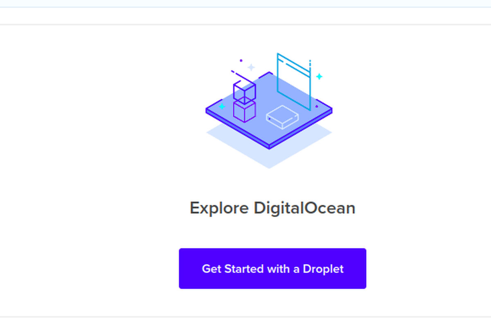

Click that button and you will go to a new page like this :

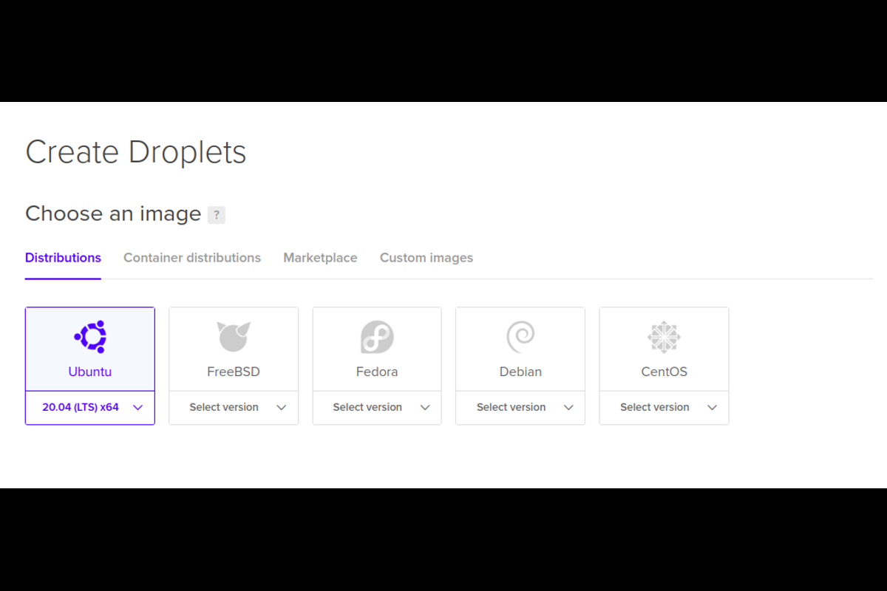

The minimum requirements to run Appwrite is as little as 1 CPU core and 2GB of RAM, and an operating system that supports Docker. We will use the default one using Ubuntu 20.04 and RAM 2GB :

 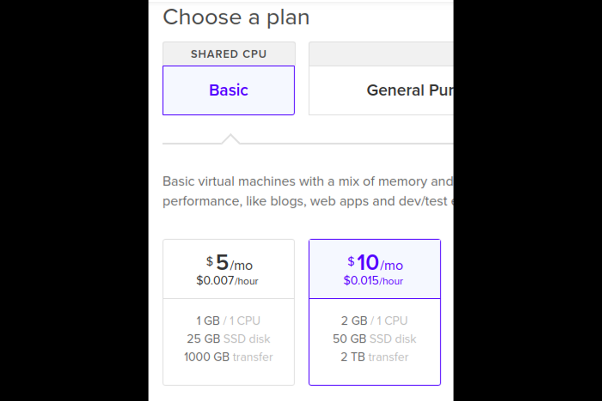
 
Scroll down into password section you can choose either using ssh keys or password we gonna use ssh keys because it's much more secure :

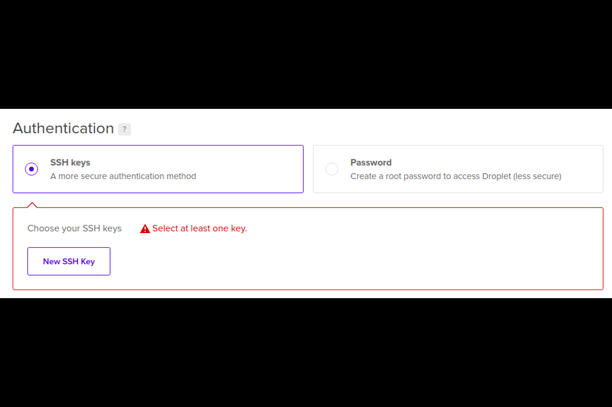

Click "New SSH Key" and then you will get this window :

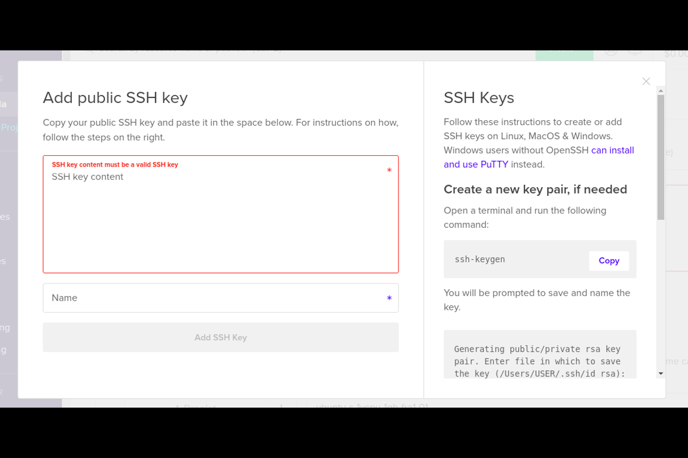

There is a detailed explanation on how to make ssh key on the right hand side of the window, follow that instruction :

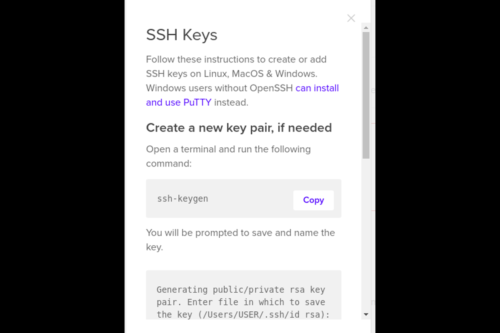

Copy paste the ssh key you get from before like this :

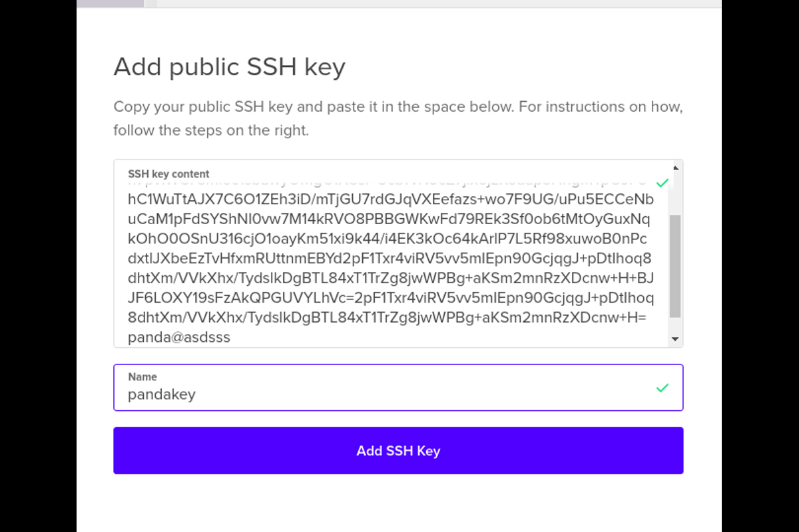

Give it a name and click "Add SSH Key", now you're done setting up your ssh keys, scroll down until you see button "Create Droplet" like below :

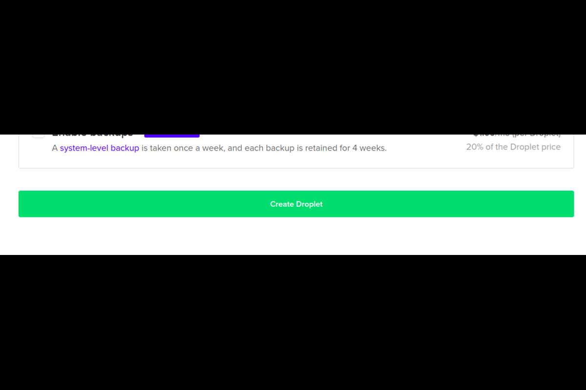

Ok now you're done creating your first droplet you will see in your homepage something like this (blurred image is your ip address and your droplet name) :

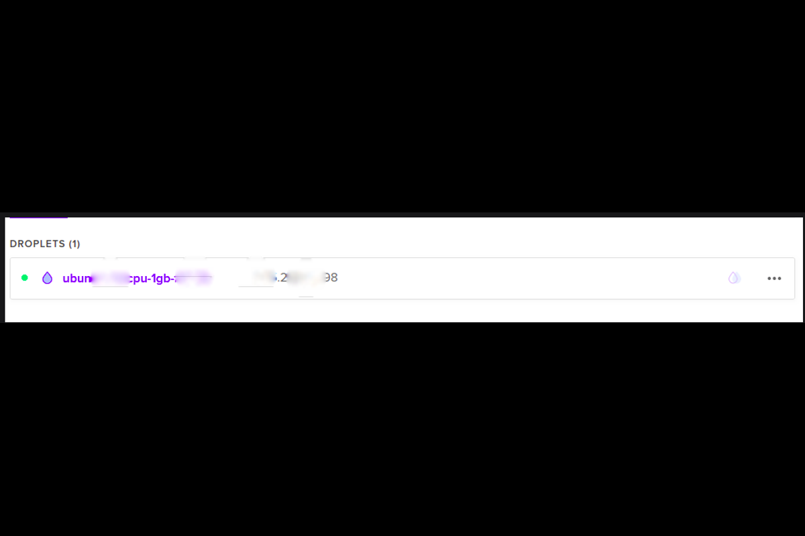

## Step 2 - Run The Appwrite server

So in order for us to access the droplet that we create earlier we should use terminal for accessing it so first of all go to your terminal and type :

```bash
ssh root@<ip address> # you can see your ip address in your homepage
```

After you login into your droplet run this command one by one to install docker :

```bash
sudo apt-get remove docker docker-engine docker.io containerd runc
sudo apt-get update
sudo apt-get install \
    apt-transport-https \
    ca-certificates \
    curl \
    gnupg-agent \
    software-properties-common
curl -fsSL https://download.docker.com/linux/Ubuntu/gpg | sudo apt-key add -
sudo apt-key fingerprint 0EBFCD88
sudo add-apt-repository \
   "deb [arch=amd64] https://download.docker.com/linux/ubuntu \
   $(lsb_release -cs) \
   stable"
sudo apt-get update
sudo apt-get install docker-ce docker-ce-cli containerd.io
sudo groupadd docker
sudo usermod -aG docker $USER
newgrp docker 
```

After we install docker, we're going to install docker-compose :

```bash
sudo curl -L "https://github.com/docker/compose/releases/download/1.27.4/docker-compose-$(uname -s)-$(uname -m)" -o /usr/local/bin/docker-compose
sudo chmod +x /usr/local/bin/docker-compose
```

After that we install Appwrite server :

```bash
docker run -it --rm \
    --volume /var/run/docker.sock:/var/run/docker.sock \
    --volume "$(pwd)"/Appwrite:/install/Appwrite:rw \
    -e version=0.6.2 \
    appwrite/install
```

Input this according to your need for this tutorial we gonna go with the default :

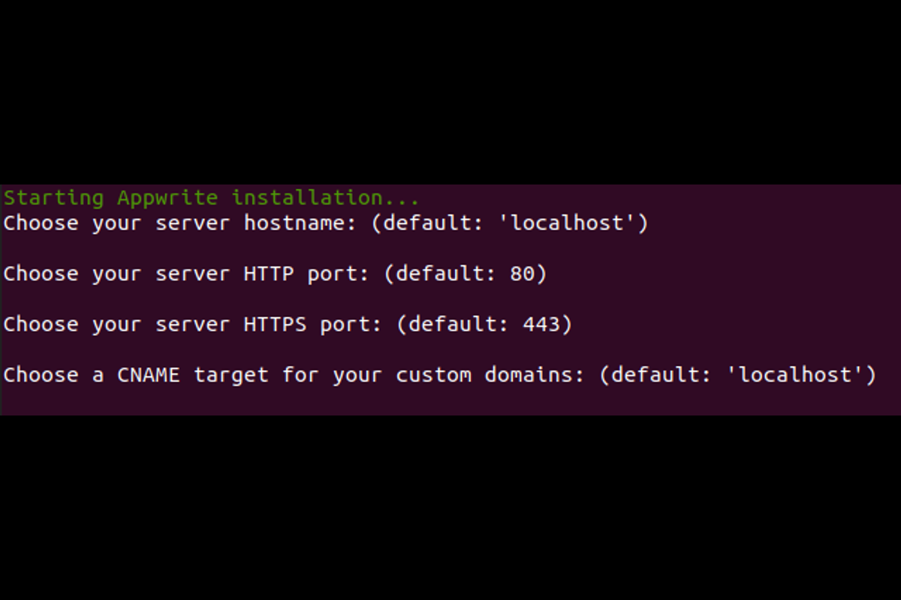

After it's all done you gonna see something like this :

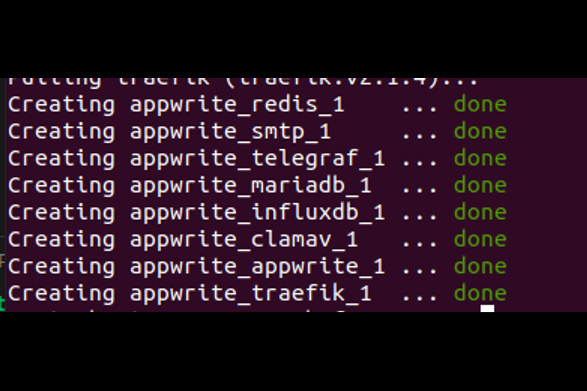

Exit your terminal and go to your browser and type your droplet ip address that you can get in your DigitalOcean project homepage before, it usually take 1 minute or less to start your server you will see this in your browser if you successfully run your server :

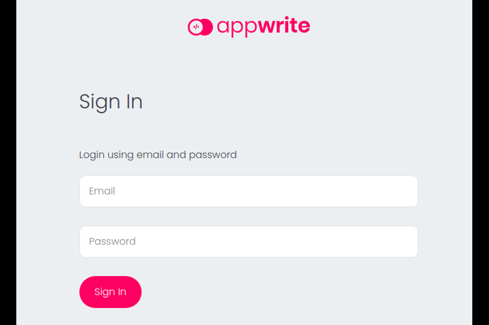

To get started, sign up with your email address and password :

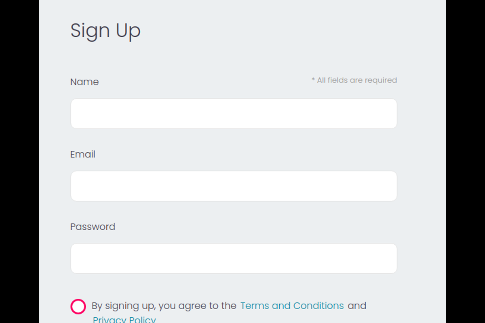

After that create a project :

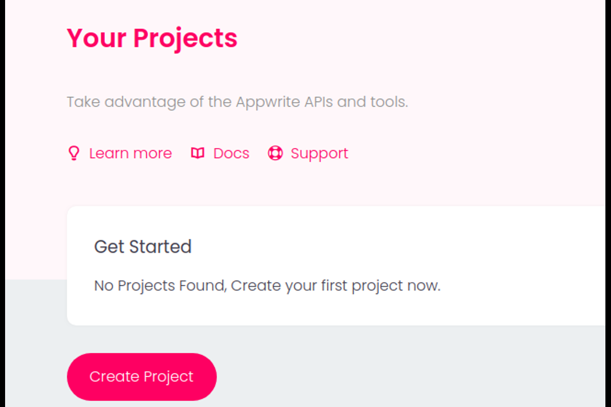

After that if you go to this screen you are successfully deploying your Appwrite server into DigitalOcean :

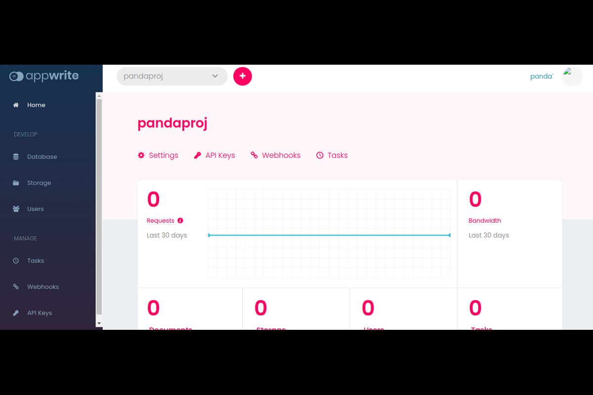

# Conclusion

Now that you have your Appwrite server deployed, you have many options for the type of application you want to build and the technologies you want to use to create a richer experience.

Good luck on your future development using Appwrite! If you need any help, feel free to join the [Discord](https://appwrite.io/discord) or refer to the [Appwrite Documentation](https://appwrite.io/docs). 
