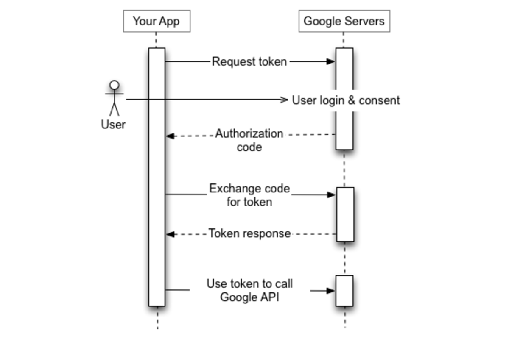

# Create Account Session through AppWrite with Google's OAuth 2.0!

## Features :
- Allow the user to login to his account using Google's OAuth 2.0 
- Each OAuth2 provider should be enabled from the Appwrite console first
- Use the success and failure arguments to redirect a URL's back to your app when login is completed

### The Google OAuth 2.0 endpoint supports web server applications that use languages and frameworks such as PHP, Java, Python, Ruby, and ASP.NET.
## What actually happens?
The authorization sequence begins when your application redirects a browser to a Google URL
The URL includes query parameters that indicate the type of access being requested
Google handles the user authentication, session selection, and user consent
The result is an authorization code, which the application can exchange for an access token and a refresh token
The application should store the refresh token for future use and use the access token to access a Google API
Once the access token expires, the application uses the refresh token to obtain a new one



## Google Side of setup required to gain authorization:
### Create the authorization credentials for your application:
1. [Go here](https://console.developers.google.com/apis/credentials) for creating authorization credentials  
2. Click **Create credentials** > **OAuth client ID**
3. Select the **Web application** application type
4. Fill in the form and click **Create**  
Applications that use languages and frameworks like PHP, Java, Python, Ruby, and .NET must specify authorized **redirect URIs**
The redirect URIs are the endpoints to which the OAuth 2.0 server can send responses.
Your application can now succesfully use this credential for gaining access to APIs that you want to enable

### Load the Google Platform Library
You must include the Google Platform Library on your web pages that integrate Google Sign-In.
```html
    <script src="https://apis.google.com/js/platform.js" async defer></script>
```  

### Specify your app's client ID
Specify the client ID you created for your app in the Google Developers Console with the ```google-signin-client_id``` meta element
```html
<meta name="google-signin-client_id" content="YOUR_CLIENT_ID.apps.googleusercontent.com">
```
### Add a Google Sign-In button
The easiest way to add a Google Sign-In button to your site is to use an automatically rendered sign-in button. With only a few lines of code, you can add a button that automatically configures itself to have the appropriate text, logo, and colors for the sign-in state of the user and the scopes you request.

To create a Google Sign-In button that uses the default settings, add a div element with the class g-signin2 to your sign-in page:
```html
<div class="g-signin2" data-onsuccess="onSignIn"></div>
```

## Appwrite's side of setup:

### Use : _get_ command and _/account/sessions/oauth2/google_ as the suffix for your API Endpoint

## Example Request
```js
let sdk = new Appwrite();

sdk
    .setEndpoint('https://[HOSTNAME_OR_IP]/v4/account/sessions/oauth2/google') // Your API Endpoint
    .setProject('5df5acd0d48c2'); // Your application ID

// Go to OAuth provider login page
sdk.account.createOAuth2Session('google');
```

## Functions Appwrite provides :
```php 
    function getLoginURL(): string
```  
- Returns the Google login URL to redirect the user for signing in  

```php 
    function getAccessToken(string $code): string
```  
- Returns the access token for authorization code passed  

```php 
    function getUserID(string $accessToken) 
```
- Returns the user's ID for the access token passed  

```php 
    function getUserEmail(string $accessToken) 
```
- Returns the user's email for the access token passed  

```php 
    function getUserName(string $accessToken) 
```
- Returns the user's name for the access token passed  

```php 
    function getUser(string $accessToken) 
```
- Returns the array of all the details(ID, email, name) of the user whose access token is passed  

### Note:
#### Rate Limits
This endpoint is limited to 50 requests in every 60 minutes per IP address.   
We use rate limits to avoid service abuse by users and as a security practice.  
[Learn more about rate limiting](https://appwrite.io/docs/rate-limits)

References:
[Appwrite Docs](https://appwrite.io/docs/client/account?sdk=web)
[Google's Web Sign-in Guide](https://developers.google.com/identity/sign-in/web/sign-in)
[Whats OAuth 2.0?](https://developers.google.com/identity/protocols/oauth2)
